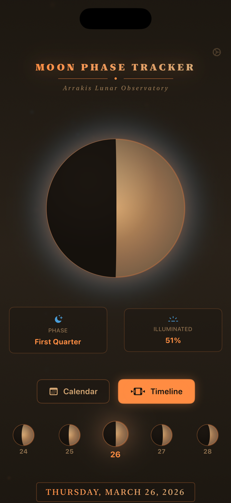
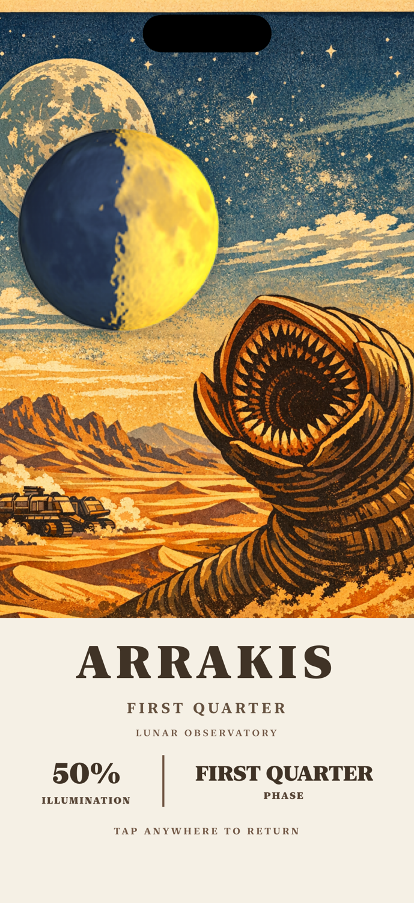

# 🌙 Lithium - Dune-Inspired Moon Phase Tracker

A beautiful iOS app that tracks lunar phases with a stunning Dune/Arrakis-inspired interface. Built with SwiftUI, Lithium combines accurate astronomical calculations with an immersive vintage poster aesthetic.

> **Quick Links:** [Documentation Index](docs/index.md) | [Build Guide](docs/BuildAndRun.md) | [GitHub](https://github.com/tholewis/dune-moon)



## ✨ Features

### 📅 Interactive Timeline
- Swipe through an infinite scrollable timeline to view moon phases for any date
- Visual day-of-week indicators with color-coded current day
- Smooth animations and intuitive gesture controls

### 🌑 Accurate Moon Phase Calculations
- Real-time moon phase visualization with custom-drawn graphics
- Precise illumination percentage calculations
- Phase names (New Moon, Waxing Crescent, First Quarter, Waxing Gibbous, Full Moon, Waning Gibbous, Last Quarter, Waning Crescent)
- Days until next major phase
- Waxing/waning status indication

### 🌅 Moonrise & Moonset Times
- Location-aware calculations using GPS
- Proper astronomical algorithms accounting for:
  - Earth's rotation and orbit
  - Moon's declination and right ascension
  - Local sidereal time
  - Geographic coordinates

### 🏜️ "On Arrakis" Poster View
- Tap the desert planet button to enter an immersive fullscreen experience
- Vintage WPA National Park poster aesthetic inspired by Dune
- Dynamic moon emoji that updates based on current phase
- Beautiful hand-crafted desert landscape illustration featuring:
  - Sandworm emerging from dunes
  - Settlement (sietch) buildings
  - Starry night sky with flowing clouds
  - Layered sand dunes



## 🛠️ Technology Stack

- **Language**: Swift 6.0
- **Framework**: SwiftUI
- **Minimum iOS**: iOS 15.0+
- **Architecture**: MVVM pattern with reactive state management
- **Location Services**: CoreLocation for GPS coordinates
- **Graphics**: Custom Shape protocols and Canvas API

## 📱 Requirements

- iOS 15.0 or later
- Xcode 15.0 or later
- Swift 6.0 or later

## 🚀 Installation

1. Clone the repository:
```bash
git clone https://github.com/tholewis/dune-moon.git
cd dune-moon
```

2. Open the project in Xcode:
```bash
open Lithium.xcodeproj
```

3. Select your target device or simulator

4. Build and run (⌘R)

### Location Permissions

The app requires location permissions to calculate accurate moonrise/moonset times. Make sure to add the following to your `Info.plist`:

```xml
<key>NSLocationWhenInUseUsageDescription</key>
<string>Lithium needs your location to calculate accurate moonrise and moonset times for your area.</string>
```

## 📖 Usage

1. **View Current Moon Phase**: Launch the app to see today's moon phase with detailed information
2. **Browse Timeline**: Swipe left or right on the timeline to navigate through dates
3. **Select a Date**: Tap any date in the timeline to view its moon phase details
4. **Arrakis View**: Tap the desert planet button in the top-right to enter the immersive poster view
5. **Return**: Tap anywhere in the Arrakis view to return to the main interface

## 🏗️ Project Structure

```
Lithium/
├── LithiumApp.swift              # App entry point
├── ContentView.swift             # Main view with timeline and moon display
├── MoonPhaseView.swift           # Custom moon phase visualization
├── MoonPhaseCalculator.swift    # Astronomical calculation engine
├── TimelineView.swift            # Horizontal date timeline
├── PhaseInfoPanel.swift          # Detailed phase information panel
├── ArrakisMoonView.swift         # Fullscreen Arrakis poster view
├── LocationManager.swift         # GPS location services
├── SpiceGlowEffect.swift         # Custom visual effects
├── CalendarGridView.swift        # Calendar helper utilities
└── Assets.xcassets/
    └── ArrakisPoster.imageset/  # Vintage poster artwork
```

## 🔬 How It Works

### Moon Phase Calculation
Lithium uses the synodic month (29.53 days) to calculate moon phases based on a reference new moon date. The phase is computed as:

```swift
let daysSinceNewMoon = daysBetween(from: referenceNewMoon, to: date)
let phase = (daysSinceNewMoon.truncatingRemainder(dividingBy: synodicMonth)) / synodicMonth
```

### Moonrise/Moonset Calculation
The app implements proper astronomical algorithms:
1. Calculate Julian Date for the given date/time
2. Compute Moon's ecliptic coordinates (longitude, latitude)
3. Convert to equatorial coordinates (right ascension, declination)
4. Calculate local sidereal time
5. Determine hour angle for rise/set events
6. Convert to local time accounting for timezone

For detailed technical documentation, see the [docs folder](docs/).

## 📚 Documentation

**👉 Start here:** [Documentation Index](docs/index.md) - Complete navigation guide to all documentation

Comprehensive developer documentation is available:

### Quick Start
- **[Build & Run Guide](docs/BuildAndRun.md)** - Installation, setup, and deployment instructions
- **[Documentation Index](docs/index.md)** - Navigation hub for all documentation

### Architecture & Design
- **[Architecture Guide](docs/Architecture.md)** - MVVM patterns, data flow, state management
- **[UI Components](docs/UIComponents.md)** - SwiftUI views, design system, color palette

### Technical Reference
- **[Moon Phase Calculations](docs/MoonPhaseCalculation.md)** - Astronomical algorithms and formulas
- **[Claude Code Skills](docs/ClaudeCodeSkills.md)** - Development automation and testing tools

### AI-Friendly Resources
- **[CLAUDE.md](CLAUDE.md)** - AI assistant documentation standards and guidelines
- **[llms.txt](llms.txt)** - AI-optimized project summary and quick reference

## 🤖 Claude Code Skills

This project includes custom Claude Code skills for development automation:

- **`/test-moon-phases`** - Validate calculation accuracy against known data
- **`/preview-arrakis`** - Instant UI preview and design iteration
- **`/update-docs`** - Auto-sync documentation with code changes
- **`/check-astronomy`** - Verify accuracy against NASA/USNO reference data

See [Claude Code Skills Documentation](docs/ClaudeCodeSkills.md) for detailed usage guide.

## 🎨 Design Inspiration

The "On Arrakis" feature is inspired by:
- Frank Herbert's *Dune* universe and the desert planet Arrakis
- Vintage WPA (Works Progress Administration) National Park posters from the 1930s-40s
- Mid-century modern design aesthetics
- Minimalist flat illustration styles

## 🤝 Contributing

Contributions are welcome! Please feel free to submit a Pull Request. For major changes, please open an issue first to discuss what you would like to change.

1. Fork the repository
2. Create your feature branch (`git checkout -b feature/AmazingFeature`)
3. Commit your changes (`git commit -m 'Add some AmazingFeature'`)
4. Push to the branch (`git push origin feature/AmazingFeature`)
5. Open a Pull Request

## 📝 License

This project is licensed under the MIT License - see the [LICENSE](LICENSE) file for details.

## 👨‍💻 Author

**Thomas Lewis**

## 🙏 Acknowledgments

- Astronomical calculation algorithms based on Jean Meeus' *Astronomical Algorithms*
- Moon phase emoji provided by Unicode Consortium
- Arrakis poster artwork inspired by vintage National Park poster designs
- Dune universe created by Frank Herbert

## 📧 Contact

For questions, suggestions, or issues, please open an issue on GitHub.

---

*"He who controls the moon phases controls the universe."* - Lithium Motto (adapted from Dune)
